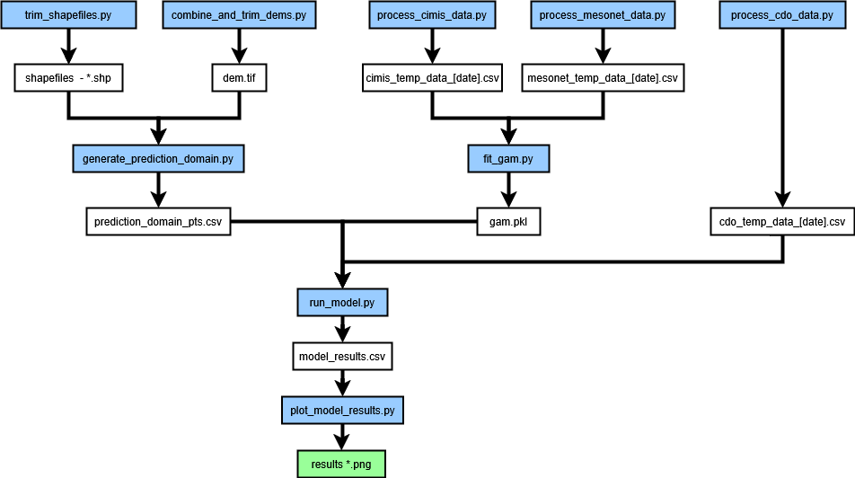

# Morel Maps
## Purpose

In the Western United States, the morel mushroom's (*Morchella sp.*) fruiting pattern is highly correlated with forest disturbance events, including logging, tree death, and most notably wildfires. Though still somewhat a mystery, fruiting onset is thought to depend on the soil temperature - accumulated degree days, in particular. Thus, in the spring following a wildfire, if one can estimate soil temperature in a burn area, one can gain an indication of when and where to go hunting for morels. These scripts produce such estimates.

The 2024 Park Fire near Chico, CA had the largest burn area, and is considered here.

## Structure

The file structure is as follows:

The code is compartmentalized both across data types, and along the process. Various "check plots" are produced to monitor the state of each block of the process.

### Inputs

#### Temperature
Fundamentally, as the literature shows, soil temperature can be modeled as a function of air temperature. Thus, we need temperature data: paired air and soil temperature data to model the relationship, and air temperature data near the spatial estimation points to predict temperature. the current version of the model uses two sources for the air-soil relationship, and one for inputs to the estimation model

* California Irrigation Management Information System (CIMIS) air and soil temperature data
* National Mesonet data from RAWS (Remote Automated Weather Stations), CWOP (Citizens Weather Observer Program), etc... air and soil temperature data.
* Global Historical Climatology Network daily (GHCNd) air temperature data.

These three datasets are collected via API in the following scripts:

* process_cimis_data.py
* process_mesonet_data.py
* process_cdo_data.py

and saved in 

* cimis_temp_data_[date].csv
* mesonet_temp_data_[date].csv
* cdo_temp_data_[date].csv

for their last update [date].

API credentials are kept in api_config.yml, which has the following structure:

'''
API:
  Netork_Name:
    key: [your_key]
    type: [type of key]
    data_filename: [Network_name]_temp_data
'''

#### Spatial

There are two main types of spatial input date (stored in /Data/GIS): feature shapefiles and digital elevation models (DEM). The raw inputs to these files are very large and not on GitHub - however, the scripts that produce them and their products are:

* trim_shapefiles.py
* combine_and_trim_dems.py

and

* Fire perimeter shapefile (Park_Fire_Perimeter_2024.shp)
* Forest service land shapefile (fs_land.shp)
* Forest service road shapefile (fs_roads.shp)
* DEM for fire perimeter (dem.tif)

These scripts should only need be run once per fire. Global spatial settings are maintained in geo_config.yml

## Model Prep

Both the spatial and temperature data need to be further processed before the model can be run

* **Spatial:** generate_prediction_domain.py combines the fire perimeter shapefile and the DEM to generate (x,y,z) points for the soil temperature estimation, produces prediction_domain_pts.csv.
* **Temperature:** fit_gam.py fits a generalized additive model (GAM) to paired air-soil data, which will be used to estimate soil temperature at each spatial point, produces gam.pkl.

## Model

The model takes in three inputs:

* prediction_domain_pts.csv - the lat/lon/elev inputs to the model
* cdo_temp_data_[date].csv - air temperature time series near the prediction domain
* gam.pkl - the model to produce soil temperature estimates

At each domain point, the following three-step process id performed:
1. An air temperature time series is interpolated from nearby observations
2. The GAM estimates a soil temperature time series from air temperature, time, elevation, and latitude.
3. Soil temperature is post-processed to compute morel-related temperature indicators.

### Results

The primary results are 5 plots of key soil temperature (C) related indicators estimated for the burn area spatial domain, each of which can provide indication on morel fruiting potential.

1. **Soil_avg_[date] -** estimated soil temp on [date].
2. **Soil_cum_[date] -** cumulative estimated soil temp on [date].
3. **Soil_mov_[date] -** 10-day moving average estimated soil temp on [date].
4. **Soil_cum_thresh_prob_[date] -** probability that cumulative soil temp has crossed the fruiting threshold.
5. **Soil_mov_thresh_prob_[date] -** probability that the soil temperature moving average exceeds 10 C.

Of these, 4. offers the most sophistication and basis in the morel ecology literature.
